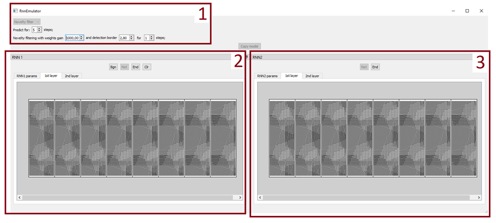
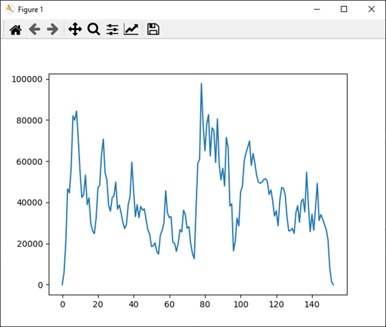
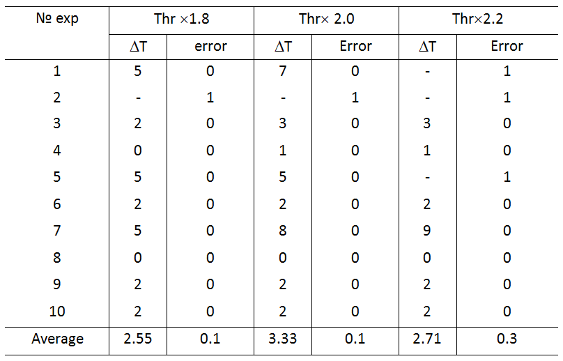

# Neural network system for forecasting and novelty filtering in text data

This program implements the neural network [1] and implements the functionality described in the articles [2, 3]. On top of this, within the Research Center, new rules for associative interaction of signals in the RNN and neural network management have been developed and implemented programmatically, allowing both to predict the content of news and to evaluate and highlight novelty from text news streams. A new criterion for the novelty of texts processed in the RNN has been implemented.

The project is developed and maintained by the research team, which is a part of the Research Center "Strong Artificial Intelligence in Industry" (ITMO University)
Site: https://sai.itmo.ru/

Author - Dmitriy Miloserdov (SPC RAS). 

License: GNU GPL v3

## Contents

1. [Description](#Description)
2. [Demo](#Demo)
3. [How-to-use](#How-to-use)
4. [Bibliography](#Bibliography)

## Description
This library is designed for intelligent processing of text streams, including recognition, recovery, prediction and synthesis. It can be used to support management decisions in various fields of activity related to understanding and analyzing the content of information events, for example, in marketing, public safety, urban management and others.
The component implementing the algorithm for modeling n-instances of a neural network with controlled elements includes instances of neural networks RNN-1 and RNN-2, which are instances of the Rnn12Core class, control units of these RNNs, whose functions are also implemented in the Rnn12Core class. In addition, RNN-1 and RNN-2 contain structures of the parameters of the functioning of the system as a whole (CommonParams) and RNN in particular (RnnParams). There is also a common GUI, an instance of the GUI class as part of CommonParams.

The input and output data of the component are aggregates of single pulses, which are arrays of binary data of size d×q×K, where d, q are the dimensions of the logical field of the RNN, K is the number of SSP in the sample.

## Demo
The system is already configured to run an example of novelty filtering in a text data stream.
The program is launched by executing a script main.py . A GUI window will open, consisting of 3 main areas: 1 – basic tinctures, 2 and 3 – visualization of layers of RNN-1 and RNN-2, respectively.

In area 2, you need to click the “BGN” button, and the program execution will begin.
In the process of execution, text data in encoded form passes through RNN-1 and the dynamics of changes in weights is analyzed. When the novelty detection threshold is exceeded, data from RNN-1 is copied to RNN-2 and filtering is started. Filtered word associations representing novelty are output to the results_noveltyFiltering folder in a text file “results_xxxxxxxx.txt ”, where xxxxxxxx is the timestamp. At the end of processing the text stream, a graph with the history of the dynamics of changes in the weights of the synapses of the neural network system will also be displayed:

The detection threshold can be adjusted by the "detection border" parameter located in area 1 of the graphical interface (see figure).
To speed up processing, you can disable the visualization of layers. To do this, set the draw_layers parameter to False in the settings_common.ini file before starting the program.

Initial data:
The source data attached to the program implements the example from the article. They are located in the example_data_noveltyFiltering folder. There are two files located there:
stream_text_data_encoded_to_SSPs.txt – pre-prepared binary data containing encoded information about word connections for 150 matrices with a size of 1200 connections (for processing on a logical field of 60x20 neurons).
connections_dictionary.txt – a list of links encoded in this example.
The .ini files of the program settings used to filter novelty.

Forecasting
To run the prediction example, you need to replace the files settings_common.ini, settings_rnn1.ini and settings_rnn2.ini in the main directory with those in the example_data_forecasting folder, and then call main.py and click the “BGN” button in the RNN-1 window. The processing of a sequence of 50 sets of words with a dictionary size of 1000 will begin, in which the prediction will be launched at 35, 40 and 45 steps. The prediction results will be output to the results_forecasting folder in a text file “results_xxxxxxxx.txt ”, where xxxxxxxx is the timestamp.
Metrics used to evaluate prediction accuracy include the percentage of misses (pe0) and the percentage of false positives (pe1).

Time delays (ΔT) and novelty detection errors at different detection thresholds (Thr) are presented in the table

## How-to-use

1. Install Python 3.8
2. Install requirements (see requirements.txt)
3. Run main.py
It is recommended to run the project in the PyCharm environment. Running in other environments has not been tested and may lead to the loss of paths and dependencies.

## Bibliography

[1] https://doi.org/10.1016/j.neucom.2018.05.009

[2] https://doi.org/10.1007/s00521-020-04843-5

[3] https://doi.org/10.1016/j.eswa.2020.114521

