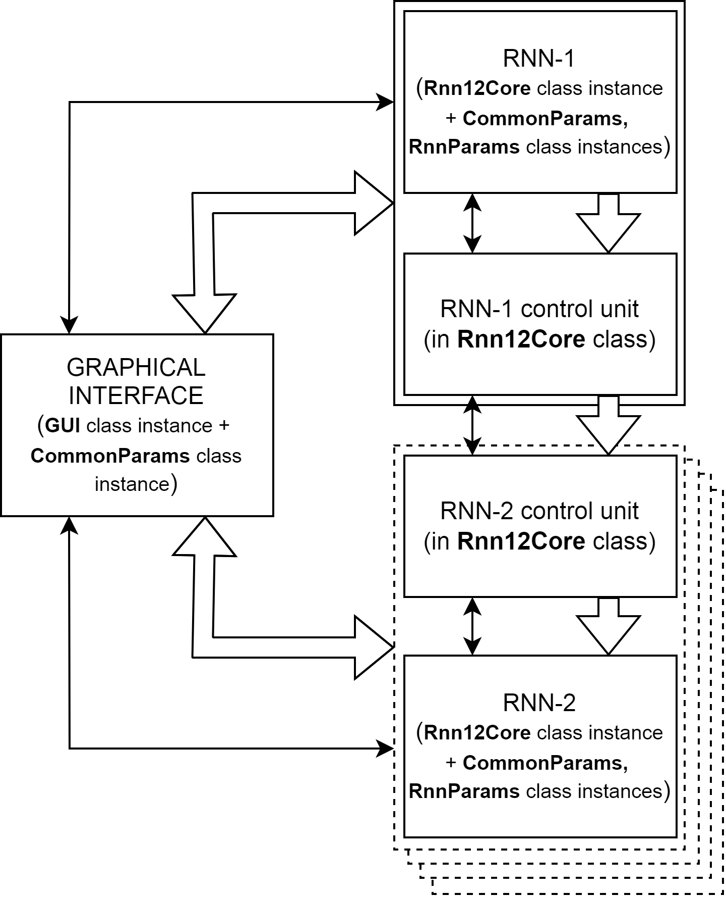
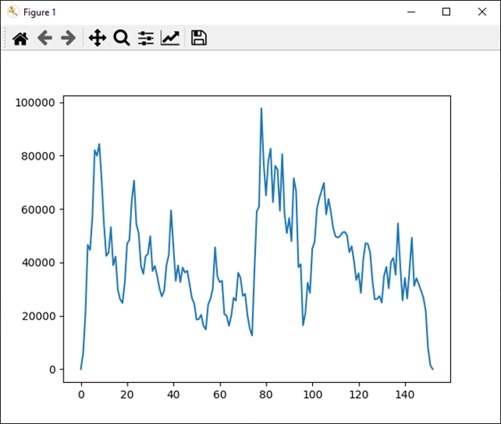
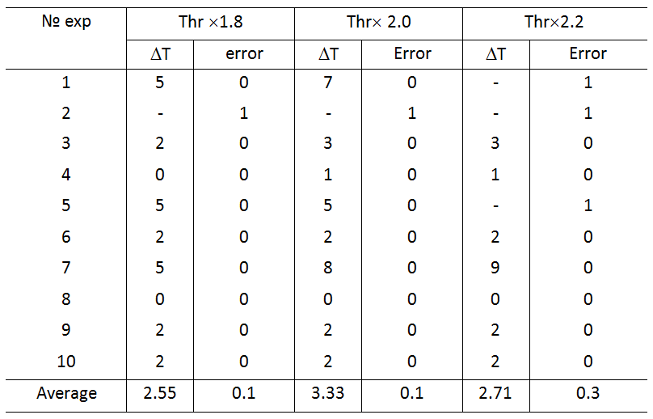

# Нейросетевая система прогнозирования и фильтрации новизны в текстовых данных

Эта программа реализует нейронную сеть [1] и функциональность, описанную в статьях [2, 3]. Кроме того, в рамках Исследовательского центра разработаны и реализованы программно новые правила ассоциативного взаимодействия сигналов в РНС и управления нейронной сетью, позволяющие как прогнозировать содержание новостей, так и оценивать и выделять новизну из текстовых потоков новостей. Был внедрен новый критерий новизны текстов, обработанных в РНС.

Проект разработан и поддерживается исследовательской группой, которая является частью Исследовательского центра "Сильный ИИ в промышленности" (Университет ИТМО)
Сайт: https://sai.itmo.ru/

Автор - Дмитрий Милосердов (СПб ФИЦ РАН). 

Лицензия: BSD-3

## Содержание

1. [Описание](#Описание)
2. [Демо](#Демо)
3. [Как-использовать-с-ГУИ](#Как-использовать-с-ГУИ)
4. [Как-использовать-из-Python](#Как-использовать-из-Python)
5. [Как-использовать-со-своими-данными](#Как-использовать-со-своими-данными)
6. [Библиография](#Библиография)

## Описание
Эта библиотека предназначена для интеллектуальной обработки новостных текстовых потоков, включая распознавание, восстановление, предсказание и синтез. Она позволяет качественно и своевременно обрабатывать информационные потоки, связанные с интерпретацией событий, может стать основой для составления прогнозов, построения автоматических систем поддержки принятия решений с проактивным управлением и, соответственно, принятия важных управленческих решений.

В состав проекта входит демонстрация для ознакомления с библиотекой, которая включает в себя полностью готовые к запуску примеры фильтрации новизны и прогнозирования текстовых потоков новостей. Примеры можно запускать как с помощью графического интерфейса, так и с помощью командной строки. Предлагаемое программное обеспечение также может быть использовано для ваших пользовательских данных. Описание процедуры подготовки и запуска дано в описании репозитория и в документации.

В состав компонента, реализующего алгоритм моделирования n-экземпляров нейронной сети с управляемыми элементами, входят экземпляры нейронных сетей РНС-1 и РНС-2, являющиеся экземплярами класса Rnn12Core, блоки управления этими РНС, функции которых также реализованы в классе Rnn12Core. Кроме того, РНС-1 и РНС-2 содержат структуры параметров функционирования системы в целом (CommonParams) и РНС в частности (RnnParams). Существует также общий графический интерфейс, представленный экземпляром класса графического интерфейса и экземпляром класса CommonParams.

Входными и выходными данными компонента являются совокупности одиночных импульсов, представляющие собой массивы двоичных данных размером d*q*K, где d, q — размеры логического поля РНС, K — количество СЕИ в выборке.

## Демо
Система уже настроена для запуска примера фильтрации новизны или прогнозирования в текстовом потоке данных.
Чтобы запустить пример обнаружения новизны, вам необходимо заменить файлы settings_common.ini, settings_rnn1.ini и settings_rnn2.ini в главном каталоге на файлы в папке examples/example_data_noveltyFiltering.
Программа запускается выполнением скрипта main.py. Откроется окно графического интерфейса, состоящее из 3-х основных областей: 1 – основные настойки, 2 и 3 – визуализация слоев РНС-1 и РНС-2 соответственно.

В области 2 нужно нажать кнопку «BGN», и начнется выполнение программы.
В процессе исполнения текстовые данные в закодированном виде проходят через РНН-1 и анализируется динамика изменения весов. При превышении порога обнаружения новизны данные из RNN-1 копируются в RNN-2 и запускается фильтрация. Отфильтрованные словосочетания, представляющие новизну, выводятся в папку results_noveltyFiltering в текстовом файле «results_xxxxxxxx.txt», где xxxxxxxx — метка времени. По окончании обработки текстового потока также будет отображен график с историей динамики изменения весов синапсов нейросетевой системы:

Порог обнаружения можно настроить параметром «Граница обнаружения», расположенным в области 1 графического интерфейса (см. рисунок).
Для ускорения обработки можно отключить визуализацию слоев. Для этого установите для параметра draw_layers значение False в файле settings_common.ini перед запуском программы.

Входные данные:
Приложенные к программе исходные данные реализуют пример из статьи. Они находятся в папке examples/example_data_noveltyFiltering. Там находятся два файла:
stream_text_data_encoded_to_SSPs.txt – предварительно подготовленные бинарные данные, содержащие закодированную информацию о связях слов для 150 матриц размером 1200 связей (для обработки на логическом поле 60x20 нейронов).
connections_dictionary.txt — список ссылок, закодированных в данном примере.
INI-файлы настроек программы, используемые для фильтрации новизны.

Прогнозирование
Для запуска примера прогноза необходимо заменить файлы settings_common.ini, settings_rnn1.ini и settings_rnn2.ini в основном каталоге на файлы в папке examples/example_data_forecasting, а затем вызвать main.py и нажать кнопку «BGN» в окне РНС-1. Начнется обработка последовательности из 50 наборов слов с размером словаря 1000, в котором будет запускаться предсказание на 35, 40 и 45 шагах. Результаты прогноза будут выведены в папку results_forecasting в текстовом файле «results_xxxxxxxx.txt», где xxxxxxxx — метка времени.
Метрики, используемые для оценки точности предсказания, включают процент пропусков (pe0) и процент ложных срабатываний (pe1).

Временные задержки (?T) и ошибки обнаружения новизны при различных порогах обнаружения (Thr) представлены в таблице.

Подробное описание примеров см. в вики-документации в разделе «Примеры».

## Как-использовать-с-ГУИ

1. Установить Python 3.8
2. Установить зависимости (см. requirements.txt)
3. Запустить main.py

## Как-использовать-из-Python

Вы можете запускать функции библиотеки без графического интерфейса, через командную строку. Для этого введите команду:

python main_python.py --mode Novelty

если вы хотите запустить библиотеку в режиме фильтрации новизны, и:

python main_python.py --mode Predict

для запуска в режиме прогнозирования. Эти примеры берут файлы настроек из папок "examples/example_data_noveltyFiltering" и "examples/example_data_forecasting" соответственно.

Кроме того, файл main_python.py также является примером использования python API предлагаемой библиотеки. Более подробно функции и переменные python API описаны в соответствующем вики-разделе документации по этому проекту.

## Как-использовать-со-своими-данными

Вы можете использовать эту библиотеку для обработки пользовательских выборок данных новостей в целях прогнозирования или фильтрации новизны.

Для этого необходимо определить список слов или связей слов, описывающих содержание обрабатываемых данных. Критерии выбора зависят от поставленной задачи. Например, список может быть определен на основе частоты встречаемости слов (связей слов) или на основе отношения к определенной теме. Список формируется в файле .txt, где каждое новое слово (связь слов) представлено на новой строке.

Затем тексты новостей, подлежащие обработке в нейросети, фильтруются по списку. Формируется бинарная матрица, соизмеримая со списком слов (связей слов), в которой для каждого элемента перечня значение определяется исходя из наличия этого элемента в рассматриваемом тексте. Присутствию слова (связи слов) в тексте соотносится значение 1, а отсутствию — 0. Полученная последовательность нулей и единиц сохраняется в другой файл .txt. Это последовательность совокупностей одиночных импульсов, которые будут обрабатываться в нейронных сетях.

Для корректной обработки в нейронных сетях необходимо настроить размеры их слоев так, чтобы длина списка слов (связей слов) совпадала с количеством нейронов в одном логическом поле, описываемом параметрами RnnGeometry/d и RnnGeometry/q в файле settings_common.ini по следующей формуле:

list_size = d * q

Затем необходимо в переменной MainParams/processing_type выбрать режим обработки (Novelty filter или Predict), указать пути к соответствующим файлам в файле settings_rnn1.ini в параметрах IOParams/dictionary_filename и IOParams/input_data_filename и запустить обработку данных.

Дополнительные сведения о настройках в файлах ini см. в вики-документации в разделе "Структура файлов INI".

## Библиография

[1] https://doi.org/10.1016/j.neucom.2018.05.009

[2] https://doi.org/10.1007/s00521-020-04843-5

[3] https://doi.org/10.1016/j.eswa.2020.114521

