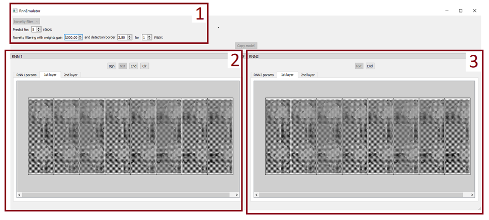
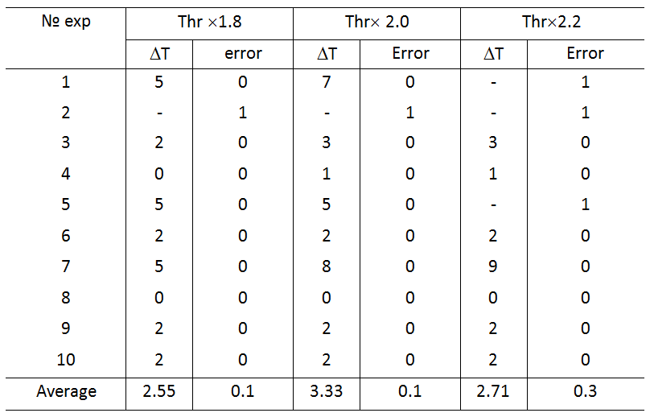

# Neural network system for forecasting and novelty filtering in text data

This program implements the neural network [1] and implements the functionality described in the articles [2, 3]. On top of this, within the Research Center, new rules for associative interaction of signals in the RNN and neural network management have been developed and implemented programmatically, allowing both to predict the content of news and to evaluate and highlight novelty from text news streams. A new criterion for the novelty of texts processed in the RNN has been implemented.

## Contents

1. [Description](#description)
2. [Demo](#demo)
3. [How to use from GUI](#how-to-use-from-gui)
4. [How to use from CLI](#how-to-use-from-cli)
5. [How to use with custom data](#how-to-use-with-custom-data)
6. [Bibliography](#bibliography)

## Description
This library is designed for intelligent processing of news text streams, including recognition, recovery, prediction and synthesis. It allows for high-quality and timely processing of news streams related to the interpretation of events, can become the basis for making forecasts, building automatic decision support systems with proactive management, and, accordingly, making important management decisions.

The project structure contains a demo for familiarization with the library, which includes fully ready-to-launch examples of novelty filtering and predicting of news text streams. The examples can be run both using the GUI and using the command line. The offered software can also be used for your custom data. A description of the preparation and launch procedure is also given in the repository description and in the documentation.

The component implementing the algorithm for modeling n-instances of a neural network with controlled elements includes instances of neural networks RNN-1 and RNN-2, which are instances of the Rnn12Core class, control units of these RNNs, whose functions are also implemented in the Rnn12Core class. In addition, RNN-1 and RNN-2 contain structures of the parameters of the functioning of the system as a whole (CommonParams) and RNN in particular (RnnParams). There is also a common GUI, an instance of the GUI class as part of CommonParams.

The input and output data of the component are aggregates of single pulses, which are arrays of binary data of size d×q×K, where d, q are the dimensions of the logical field of the RNN, K is the number of SSP in the sample.

## Demo
The system is already configured to run an example of novelty filtering or predicting in a text data stream.
To run the novelty detection example, you need to replace the files settings_common.ini, settings_rnn1.ini and settings_rnn2.ini in the main directory with those in the examples/example_data_noveltyFiltering folder.
The program is launched by executing a script main.py. A GUI window will open, consisting of 3 main areas: 1 – basic tinctures, 2 and 3 – visualization of layers of RNN-1 and RNN-2, respectively.

In area 2, you need to click the “BGN” button, and the program execution will begin.
In the process of execution, text data in encoded form passes through RNN-1 and the dynamics of changes in weights is analyzed. When the novelty detection threshold is exceeded, data from RNN-1 is copied to RNN-2 and filtering is started. Filtered word associations representing novelty are output to the results_noveltyFiltering folder in a text file “results_xxxxxxxx.txt ”, where xxxxxxxx is the timestamp. At the end of processing the text stream, a graph with the history of the dynamics of changes in the weights of the synapses of the neural network system will also be displayed:

The detection threshold can be adjusted by the "detection border" parameter located in area 1 of the graphical interface (see figure).
To speed up processing, you can disable the visualization of layers. To do this, set the draw_layers parameter to False in the settings_common.ini file before starting the program.

Initial data:
The source data attached to the program implements the example from the article. They are located in the examples/example_data_noveltyFiltering folder. There are two files located there:
stream_text_data_encoded_to_SSPs.txt – pre-prepared binary data containing encoded information about word connections for 150 matrices with a size of 1200 connections (for processing on a logical field of 60x20 neurons).
connections_dictionary.txt – a list of links encoded in this example.
The .ini files of the program settings used to filter novelty.

Forecasting
To run the prediction example, you need to replace the files settings_common.ini, settings_rnn1.ini and settings_rnn2.ini in the main directory with those in the examples/example_data_forecasting folder, and then call main.py and click the “BGN” button in the RNN-1 window. The processing of a sequence of 50 sets of words with a dictionary size of 1000 will begin, in which the prediction will be launched at 35, 40 and 45 steps. The prediction results will be output to the results_forecasting folder in a text file “results_xxxxxxxx.txt ”, where xxxxxxxx is the timestamp.
Metrics used to evaluate prediction accuracy include the percentage of misses (pe0) and the percentage of false positives (pe1).

Time delays (ΔT) and novelty detection errors at different detection thresholds (Thr) are presented in the table

For a detailed description of the examples, see the documentation wiki in the Examples section.

## How to use from GUI

1. Install Python 3.8
2. Install requirements (see requirements.txt)
3. Run main.py

## How to use from CLI

You can run the library functions without a graphical interface, via the command line. To do this, enter the command:

python main_python.py --mode Novelty

if you want to run library in novelty filtering processing type, and:

python main_python.py --mode Predict

for run in predict processing type. This examples got settings files from folders "exaples/example_data_noveltyFiltering" and "examples/example_data_forecasting", respectively.

In addition, the main_python.py file is also an example of using the python API of the proposed library. The functions and variables of the python API are described in more detail in the corresponding wiki section of the documentation for this project.

## How to use with custom data

You can use this library to process your custom news data samples for forecasting or novelty filtering purposes.

To do this, you need to define the list of words or word connections that describe the content of the data to be processed. The selection criteria depend on the task. For example, a list can be determined based on the frequency of occurrence of words (word connections), or based on the relationship to a particular topic. The list is formed in a .txt file, where each new word (word connection) is represented on a new line.

Then the news texts to be processed in the neural network are filtered according to the list. A binary matrix is formed, commensurate with the list of words (word connections), in which for each element of the list the value is determined based on the presence of this element in the text under consideration. The presence of a word (word connection) in the text is assigned the value 1, and the absence is 0. The resulting sequence of zeros and ones is saved to another .txt file. It is a sequence of sets of single pulses that will be processed in neural networks.

For correct processing in neural networks, it is necessary to configure the sizes of their layers so that the length of the list of words (word connections) coincides with the number of neurons in one logical field described by the RnnGeometry/d and RnnGeometry/q parameters in the settings_common.ini file, according to the following formula:

list_size = d * q

Then you need to select the processing mode in the MainParams/processing_type variable (Novelty filter or Predict), specify the paths to the corresponding files in the settings_rnn1.ini file in the IOParams/dictionary_filename and IOParams/input_data_filename parameters, and start data processing.

For more information about the settings in the ini files, see the wiki documentation in the section named INI files structure.

## Developers

Author - Dmitriy Miloserdov (SPC RAS). 

## Supported by

The study is supported by the [Research Center Strong Artificial Intelligence in Industry](https://sai.itmo.ru/) 
of [ITMO University](https://en.itmo.ru/) as part of the plan of the center's program: Development and testing of an experimental sample of a library of strong AI algorithms in terms of intelligent detection of events and meanings based on multimodal data (text, sound, images in different ranges) for tasks of recognizing operating modes and hardware malfunctions.

## Bibliography

[1] https://doi.org/10.1016/j.neucom.2018.05.009

[2] https://doi.org/10.1007/s00521-020-04843-5

[3] https://doi.org/10.1016/j.eswa.2020.114521

